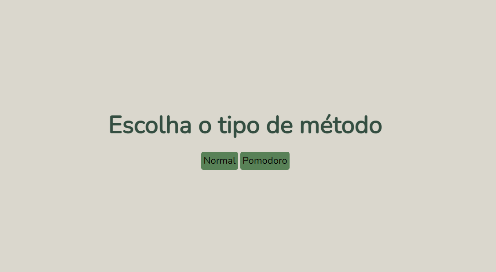
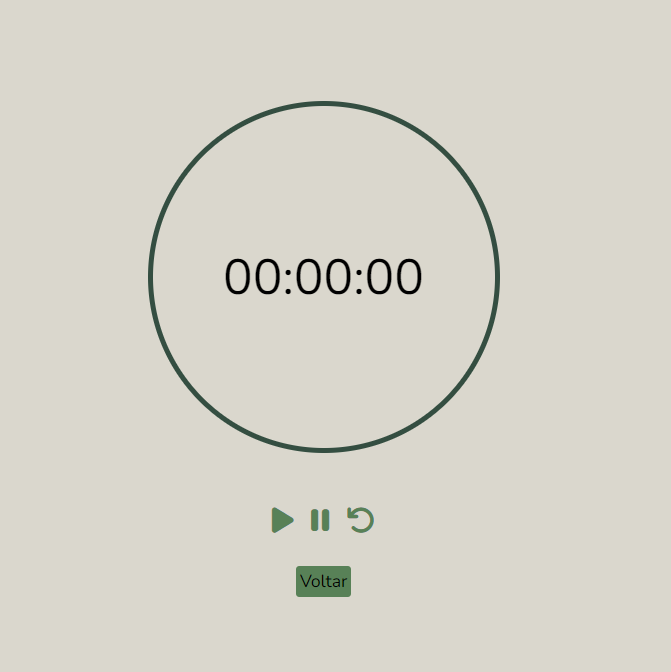
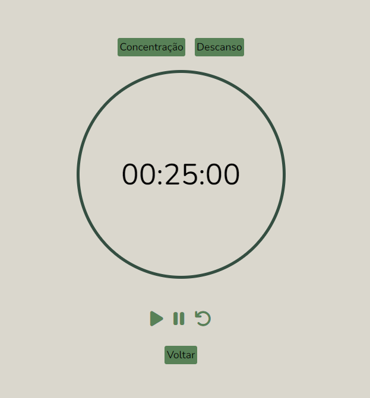
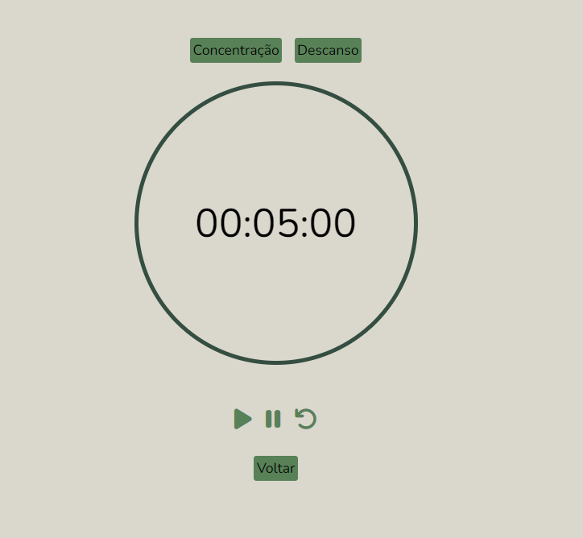

### Cronômetro

Com função de cronômetro normal, e também para o método pomodoro (25 de concentração profunda e 5 minutos de descanso), indicado para estudar! 

> [Experimente aqui](https://anasimas.github.io/cronometro/)

